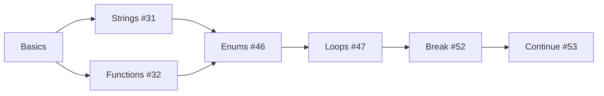

<div align="center">

# 📚 C++ Fundamentals Course

[](https://isocpp.org/)
[](https://visualstudio.microsoft.com/)
[](LICENSE)

_A comprehensive collection of C++ programming exercises covering core concepts from basics to intermediate level._

[Getting Started](#-getting-started) •
[Lessons](#-lessons-overview) •
[Requirements](#-requirements) •
[Contributing](#-contributing)

</div>

---

## 🎯 About This Repository

This repository contains structured C++ programming lessons designed to build a strong foundation in:

-   **Data Types & Structures** — Arrays, Strings, Enums, Structs
-   **Control Flow** — Loops, Break & Continue statements, Switch cases
-   **Functions** — Declaration, Parameters, Return values, Scope
-   **Best Practices** — Clean code, Modular programming

---

## 📖 Lessons Overview

| #   | Lesson                                                                                   | Description                         | Key Concepts                                          |
| --- | ---------------------------------------------------------------------------------------- | ----------------------------------- | ----------------------------------------------------- |
| 31  | [Strings](./Lesson%20%2331%20-%20Strings/)                                               | String manipulation and operations  | `string`, `length()`, `getline()`, indexing, `back()` |
| 32  | [Functions Part 1](./Lesson%20%2332%20-%20Functions%20Part%201/)                         | Introduction to functions           | Function declaration, Hello World                     |
| 46  | [Nested Functions with Enums](./Lesson%20%2346%20-%20Nested%20Functions%20with%20Enums/) | Combining enums with function calls | `enum`, `switch`, menu systems, function composition  |
| 47  | [For Loops](./Lesson%20%2347%20-%20For%20Loops/)                                         | Iteration and data structures       | `for` loops, `struct`, arrays, input/output           |
| 52  | [Break Statement](./Lesson%20%2352%20-%20Break%20Statement/)                             | Controlling loop execution          | `break`, array searching, early exit                  |
| 53  | [Continue Statement](./Lesson%20%2353%20-%20Continue%20Statement/)                       | Skipping loop iterations            | `continue`, conditional sums, input validation        |

### 📁 Additional Projects

| Project                     | Description                        | Key Concepts                           |
| --------------------------- | ---------------------------------- | -------------------------------------- |
| [Arrays](./Arrays/)         | Array fundamentals with enums      | Arrays, `enum`, `switch`, type casting |
| [Test Stars](./test_stars/) | Pattern printing with nested loops | Nested `for` loops, number patterns    |

---

## 🔍 Detailed Lesson Breakdown

<details>
<summary><b>📘 Lesson #31 - Strings</b></summary>

**Topics Covered:**

-   String declaration and initialization
-   String methods: `length()`, `back()`, indexing with `[]`
-   Reading input with `cin` vs `getline()`
-   Global variables and scope resolution operator `::`
-   Function overloading basics

**Code Highlights:**

```cpp
string str1 = "ABXDEFJHIGKLMNOPQRSTUVWXYZ";
cout << str1.length();    // Output: 26
cout << str1.back();      // Output: Z
getline(cin, str2);       // Read full line with spaces
```

</details>

<details>
<summary><b>📘 Lesson #46 - Nested Functions with Enums</b></summary>

**Topics Covered:**

-   Enum declaration and usage
-   Building interactive menu systems
-   Function composition (calling functions within functions)
-   Switch-case with enum values

**Code Highlights:**

```cpp
enum enWeekDay { Sun = 1, Mon = 2, Tue = 3, Wed = 4, Thu = 5, Fri = 6, Sat = 7 };

// Nested function call pattern
cout << "today is " << GetWeekDayName(ReadWeekDay()) << endl;
```

</details>

<details>
<summary><b>📘 Lesson #47 - For Loops</b></summary>

**Topics Covered:**

-   Struct definition and usage
-   Pass by reference with `&`
-   Array of structs
-   For loop iteration patterns

**Code Highlights:**

```cpp
struct strInfo {
    string FirstName;
    string LastName;
    int Age;
    string Phone;
};

void ReadInfo(strInfo& Info);  // Pass by reference
```

</details>

<details>
<summary><b>📘 Lesson #52 - Break Statement</b></summary>

**Topics Covered:**

-   Linear search algorithm
-   Early loop termination with `break`
-   Array traversal

**Code Highlights:**

```cpp
for (int i = 0; i <= 9; i++) {
    if (arr[i] == search) {
        cout << search << " found at position " << i << endl;
        break;  // Exit loop early when found
    }
}
```

</details>

<details>
<summary><b>📘 Lesson #53 - Continue Statement</b></summary>

**Topics Covered:**

-   Skipping iterations with `continue`
-   Input validation
-   Conditional accumulation

**Code Highlights:**

```cpp
if (number > 50) {
    cout << "Number won't be calculated\n";
    continue;  // Skip to next iteration
}
sum += number;
```

</details>

---

## 📂 Project Structure

```
cours-3/
├── 📄 README.md
├── 📁 Arrays/
│   ├── Arrays.cpp
│   ├── Arrays.sln
│   ├── Arrays.vcxproj
│   └── Arrays.vcxproj.filters
├── 📁 Lesson #31 - Strings/
├── 📁 Lesson #32 - Functions Part 1/
├── 📁 Lesson #46 - Nested Functions with Enums/
├── 📁 Lesson #47 - For Loops/
├── 📁 Lesson #52 - Break Statement/
├── 📁 Lesson #53 - Continue Statement/
└── 📁 test_stars/
```

**Each lesson folder contains:**
| File | Description |
|------|-------------|
| `*.cpp` | Main C++ source code |
| `*.sln` | Visual Studio solution file |
| `*.vcxproj` | Visual Studio project configuration |
| `*.vcxproj.filters` | Visual Studio file organization |

---

## 🚀 Getting Started

### Prerequisites

-   **Visual Studio 2019/2022** with C++ Desktop Development workload
-   **Windows 10/11** operating system

### Running a Lesson

1. **Clone the repository**

    ```bash
    git clone https://github.com/Valkenan/cours-3.git
    cd cours-3
    ```

2. **Open a lesson**

    - Navigate to the desired lesson folder
    - Double-click the `.sln` file to open in Visual Studio

3. **Build and Run**
    - Press `F5` to build and run with debugging
    - Press `Ctrl+F5` to run without debugging

---

## 📊 Learning Path



**Recommended Order:**

1. 🟢 Start with **Functions Part 1** (Lesson #32)
2. 🟢 Move to **Strings** (Lesson #31)
3. 🟡 Learn **Arrays** (Arrays project)
4. 🟡 Study **Nested Functions with Enums** (Lesson #46)
5. 🟠 Practice **For Loops** (Lesson #47)
6. 🔴 Master **Break Statement** (Lesson #52)
7. 🔴 Complete **Continue Statement** (Lesson #53)

---

## 🤝 Contributing

Contributions are welcome! Feel free to:

-   Report bugs or issues
-   Suggest new lessons or improvements
-   Submit pull requests

---

## 📝 License

This project is open source and available under the [MIT License](LICENSE).

---

<div align="center">

**⭐ Star this repository if you find it helpful!**

Made with ❤️ for C++ learners

</div>
